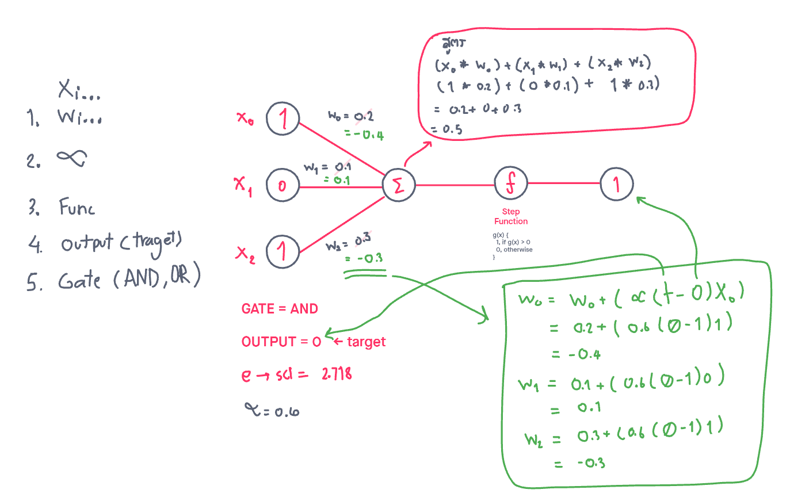

# Test

- องค์ประกอบของ ML
- มี case ให้  ให้เลือกวิธีการเรียนรู้ (algorithm) ของ ML มาใช้
- Neural network  คำนวณ weight รอบที่ 1
- ขั้นตอนการเรียนรู้ภาษาธรรมชาติ
- top-down parser
- องค์ประกอบระบบผู้เชี่ยวชาญ
- อธิบายหลักการพัฒนาระบบผู้เชี่ยวชาญจาก case ที่กำหนดให้

1. องค์ประกอบของ ML
- DATA ข้อมูล
- ALGORITHM ขั้นตอนวิธี
- FEATURES คุณสมบัติ
2.ประเภทการเรียนรู้ของ ML
- Classical Learning = การสอนMเพื่อแก้ปัญหาทางคณิตศาสตร์ อย่างเช่น ค้นหารูป
แบบตัวเลขประเมินความใกล้เคียงของข้อมูล และคำนวณทิศทางของเวกเตอร์ เป็นต้น
-Supervised = ML เรียนรู้โดยที่มีอาจารย์สอน ที่คอยให้คำตอบ
   - Classification = เป็นการพยายามที่จะทำนายคำตอบที่ไม่ต่อเนื่องกัน ไม่มีการอ้างอิงกับ
อะไรเลย
   - Regression = เป็นการพยายามที่จะทำนายคำตอบที่ต่อเนื่องกัน เช่น การคาดการณ์ราคา
หุ้น
-Unsupervised = ML เรียนรู้โดยไม่มีคนสอน
   - Clustering  = กระบวนการจัดระเบียบวัตถุเป็นกลุ่มที่มีสมาชิกคล้ายคลึงกันในทางใดทางหนึ่ง
   - Dimensionality reduction = เป็นการลดจำนวนมิติเพื่อบีบอัดข้อมูล ทำให้เราไม่จำเป็น
ต้องเก็บข้อมูลไว้ครบ
   - Association rule learning  = การหาความสัมพันธ์ของข้อมูล
- Reinforcement Learning = เทคนิคการทำปัญญาประดิษฐ์ (Artificial Intelligence)
ที่ใช้วิธีการให้รางวัล (reward) หรือลงโทษ (punishment) เพื่อที่จะขับเคลื่อนให้ agent
นั้นๆ ไปในทิศทางเป้าหมายที่ระบุไว้ได้
- Ensemble Method = เทคนิคที่สร้างแบบจำลองหลาย ๆ แบบแล้วรวมเข้าด้วยกันเพื่อ
ให้ได้ผลลัพธ์ที่ดีขึ้น
- Neural Network And Deep Learning = วิธีการเรียนรู้แบบอัตโนมัติด้วยการ เลียนแบบ
การทำงานของโครงข่ายประสาทของมนุษย์ (Neurons) โดยนำระบบโครงข่ายประสาท 
(Neural Network) มาซ้อนกัน หลายชั้น (Layer) และทำการเรียนรู้ข้อมูลตัวอย่าง

3. Neural network หา weight (วาดรูป)  
[Freehand](https://projects.invisionapp.com/freehand/document/kDlX4sEjS)

4. ขั้นตอนการเรียนรู้ภาษาธรรมชาติ (Natural Language)
- Phonological ศึกษาการออกเสียง
- Morphological Analysis ศึกษาหน่วยของคำ
- Syntactical Analysis วิเคราะห์ทางไวยากรณ์
- Semantic Analysis วิเคราะห์และแสดงความหมาย
- Discourse Integration ตรวจคำ(pronoun)ที่อ้างอิงระหว่างประโยคว่าหมายถึง noun ตัวใด
- Pragmatic Analysis ตรวจความหมายที่แท้จริงของประโยค
5. top-down parser
...
6. องค์ประกอบระบบผู้เชี่ยวชาญ (วาดรูปง่ายมาก)
- Human Expert ผู้เชี่ยวชาญ
- Knowledge Engineer ผู้ที่มีความรู้ความสามารถในศาสตร์แห่งการสร้างตรรกะขั้นสูง
ในระบบคอมพิวเตอร์เพื่อพยายามจำลองการตัดสินใจของมนุษย์และงานด้านความรู้ความ
เข้าใจระดับสูง (ผู้ที่พัฒนาระบบ Dev)
- Knowledge Base ฐานความรู้
- Inference Engine เครื่องมืออนุมาน ทำหน้าที่คำนวณหาผลลัพธ์จากข้อเท็จจริงและ
ข้อมูลสนเทศที่ได้เก็บเอาไว้แล้ว
- User Interface ส่วนต่อประสานระหว่าง user กับ สินค้าหรือบริการ
- User ผู้ใช้สินค้าหรือบริการ
7.อธิบาย<หลักการพัฒนาระบบผู้เชี่ยวชาญ>จาก case ที่กำหนดให้
ขั้นตอนการพัฒนา ES 
- ระบุโดเมนที่เป็นปัญหา
   - ปัญหาต้องเหมาะสำหรับระบบผู้เชี่ยวชาญในการแก้ปัญหา
   - ค้นหาผู้เชี่ยวชาญในโดเมนงานสำหรับโครงการ ES
   - สร้างความคุ้มทุนของระบบ
- ออกแบบระบบ
   - ระบุเทคโนโลยี ES
   - รู้และกำหนดระดับของการทำงานร่วมกับระบบและฐานข้อมูลอื่น ๆ
   - ตระหนักถึงวิธีที่แนวคิดสามารถแสดงถึงความรู้เกี่ยวกับโดเมนได้ดีที่สุด
- พัฒนา Prototype
   - จากฐานความรู้: วิศวกรความรู้ทำงานเพื่อรับความรู้เกี่ยวกับโดเมนจากผู้เชี่ยวชาญ
   - แสดงในรูปแบบของกฎ If-THEN-ELSE
- พัฒนาและดำเนินการ ES
   - ทดสอบและตรวจสอบการทำงานร่วมกันของ ES กับองค์ประกอบทั้งหมดของสภาพแวด
ล้อมรวมถึงผู้ใช้ปลายทางฐานข้อมูลและระบบข้อมูลอื่น ๆ
   - จัดทำเอกสารโครงการ ES ให้ดี
   - ฝึกผู้ใช้ให้ใช้ ES
- บำรุงรักษาระบบ
   - อัปเดตฐานความรู้ให้ทันสมัยอยู่เสมอโดยการตรวจสอบและอัปเดตเป็นประจำ
   - รองรับอินเทอร์เฟซใหม่กับระบบข้อมูลอื่น ๆ ตามที่ระบบเหล่านั้นพัฒนาขึ้น

