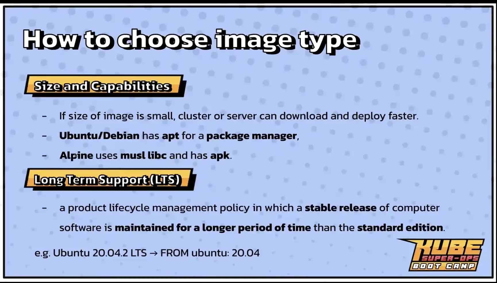

# Integratetion

(Session ไม่ค่อยเข้าใจเท่าไหร่เลย Lecture ออกมาแบบงง ๆ)

### Docker alpine image

runtime + os pakcage ถ้าเริ่มต้นแนะนำให้ใช้ alpine ไปก่อนเพราะ distroless จะมีความยากในการปั้น docker file นิดนึงถ้าเป็น application ที่มี step การ build ที่ซับซ้อนมันจะค่อนข้องออกแรงเยอะเพราะ distroless ไม่ได้ provide ตัว shell ให้เราเลย

-  สามารถใช้ exec เพื่อเข้าไปใช้ใช้ cmd ใน image ได้

```bash
docker exec -it <IMAGE_NAME> <SHELL_PATH>

# Example
docker exec -it spring-non-distroless-app /bin/sh
```

### Docker distroless image

runtime only

```bash
FROM gcr.io/distroless/java:11

COPY spring-distroless-app.jar deployment.jar

EXPOSE 8080

ENTRYPOINT [ "java", "-jar", "./deployment.jar" ]$
```

### Build

```bash
docker build -t spring-distroless-app .
```

### Run

```bash
docker run --name spring-distroless-app -d -p 8080:8080 spring-distroless-app
```

### Docker scratch

ไม่มีไรเลย run exe หรือ binary อย่างเดียว

### Other optimize

### jib plugins

Auto build pakcage

---

### Docker storage

- เวลา container ถูก kill ข้อมูลทั้งหมดใน container ก็จะหายทั้งหมดเราเลยต้อง Mount ข้อมูลออกมาไว้ใน local โดยใช้ -v
- Not recomend for production เพราะถ้าเกิด Culser ตายข้อมูลจะหายไปด้วย ถ้าจะใช้บน Production ให้ใช้พวก Storage Cloud

```bash
-v <lOCALE_PAHH>/:/<CONTAINER_PATH>
```

### Docker network

Default driver is "bridge" from [bridge, host, null]

```bash
docker network create <NETWORK_NAME>
```

### Network list

```bash
docker network ls
```

### Run the DB on docker instance

```bash
mkdir /tmp/mysql/data
```

```bash
docker run -d --name kubeops-mysql \
   -e MYSQL_ROOT_PASSWORD=kubeops_root \
   -e MYSQL_USER=kubeops_user \
   -e MYSQL_PASSWORD=kubeops_password \
   -e MYSQL_DATABASE=kubeops \
   --net kubeops-network \
   -v /tmp/mysql/data/:/var/lib/mysql \
   -p 3307:3306 \
   mysql:latest

   # If can't use on windows
   docker run -d --name kubeops-mysql -e MYSQL_ROOT_PASSWORD=kubeops_root -e MYSQL_USER=kubeops_user -e MYSQL_PASSWORD=kubeops_password -e MYSQL_DATABASE=kubeops --net kubeops-network -v /tmp/mysql/data/:/var/lib/mysql -p 3307:3306 mysql:latest
``` 

### Test
```bash
docker exec -it kubeops-mysql sh
```

```bash
cd /var/lib/mysql
cat > hello-kubeops.kubeops
ls
```

### Run the Web application on Docker Instance
```bash
docker run -d --name kubeops-web -p 8081:8088 --net kubeops-network sikiryl/spring-app
```

### Docker logs
```bash
docker logs <CONTAINER_NAME | ID>
```

### Choose image type
