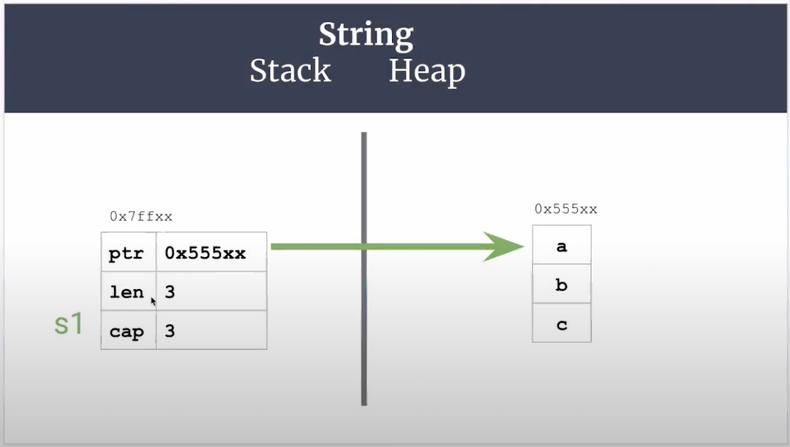

# Memory Debugger

- Stack เก็บ var ที่รู้จำนวน size ที่แน่นอนทำงานแบบ LIFO
- Heap จะเก็บ var ไว้ใน Stack แล้วเก็บ value ไว้ใน Heap แล้ว Stack จะอ้างถึง value จาก Heap ด้วย Mem Address 

ถ้าเป็นภาษาใด ๆ ใน Stack มันจะจัดการให้คุณอัตโนมัติแต่ใน Heap คุณต้องจัดการเองหรือบางภาษาจะมี GC มาช่วยจัดการให้ แต่ถ้าเป็น Rust มันพิเศษตรงที่มัน ถ้าจบ Stack แล้วมันจะคืน Heap ให้เองเลยซึ่งจะไว้กว่า GC เพราะไม่ต้องเสียเวลา Scan ที่ทำให้เสีย Latency เลย

### GDB, GEF

- Run
```sh
gdb <program_name> # Use binary file build
```

```sh
> b <func_name> # func name to start debug
> r # Run debugger
> n # Next step
> i local # Check local vars
> s # Step into

# Xmin
> x # Xmin
> xinfo &<var_name> # Get var info
> x <mem_address> # Get value
> x /d <mem_address> # Get value base 10 numbers

> c # Continue to next break point
> p <var_name> # print address and show type
> ctx source # Display source code
```

#### Handle String Mem


*https://youtu.be/GVCR8b_33zo?t=4029*
